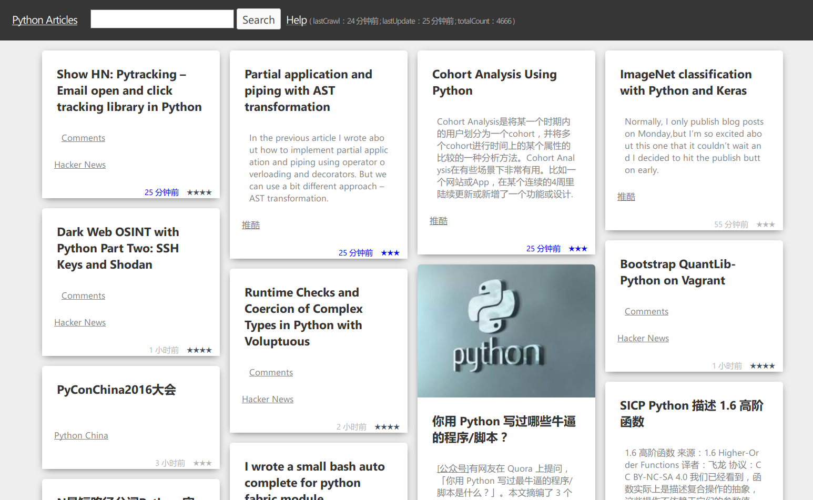

# Python 文章列表

> Simple is better than complex.

---------

>使用 [Flask](http://flask.pocoo.org) 框架编写的简单的 [Python](https://www.python.org) 示例程序, 主要用于收集平时常用网站中Python相关的文章，以便以后使用。

####[整体架构](https://www.processon.com/view/link/56f782e0e4b0d181b19c9a1c) (已作废)

####[文章来源 / 接入进度](https://www.processon.com/view/link/56f7834be4b0d713bb15d543)

**演示平台**：[heroku](http://pyld.herokuapp.com/python_articles/index)

